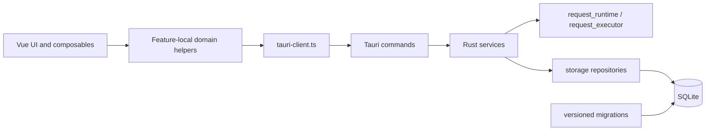

# refactor: Incremental architecture remediation roadmap

## Overview

This plan converts the confirmed 2026-04-02 architecture review findings into an incremental remediation program that preserves the shipped desktop baseline while removing the main maintainability bottlenecks. The work focuses on clearer runtime boundaries, safer schema evolution, smaller Rust ownership units, and a more complete request execution model for a daily-use API workbench.

## Problem Frame

ZenRequest already ships a credible local-first desktop baseline, but several internal seams are still at MVP maturity. The main risks are concentrated in four areas: the Rust storage layer remains monolithic, SQLite schema evolution still depends on patch-style column guards, request execution lacks core professional controls, and frontend domain rules are still split between generic helpers and app-shell orchestration. If those seams continue to accumulate features unchanged, every new capability will increase cross-cutting blast radius in both the Vue shell and the Rust runtime.

This plan assumes the goal is not a product redesign. The goal is to preserve current desktop behavior, keep the Tauri command surface stable, and move the codebase from "working MVP internals" to a maintainable 1.0-ready architecture.

## Requirements Trace

- R1. Reduce `app-shell` coordination complexity so frontend changes stop increasing cross-feature blast radius.
- R2. Replace the monolithic Rust storage layer with domain-oriented ownership units while keeping current runtime behavior stable.
- R3. Convert SQLite schema evolution from patch-style `ensure_*` guards to explicit versioned migrations.
- R4. Make request, workspace, history, and import/export rules explicit at feature and runtime boundaries without breaking current Tauri DTO/API contracts.
- R5. Extend the canonical request model so it can support `timeout`, redirect policy, proxy settings, and SSL verification as first-class execution options.
- R6. Close the current upload gap by making multipart/file and binary request execution semantics explicit and testable while preserving history redaction, session restore, and mock/live execution behavior.

## Scope Boundaries

- No desktop-to-web parity work or alternate runtime support beyond the existing Tauri boundary.
- No full relational normalization of all JSON-backed request fields in this pass.
- No activation of reserved plugin, execution hook, or tool packaging seams beyond preserving compatibility with the current registries.
- Client certificates, cookie jar policy, and true large-file streaming are explicitly deferred until the execution-options and upload correctness work is stable.
- No broad UI redesign. New editor surfaces should follow the current request panel visual system.

## Context & Research

### Relevant Code and Patterns

- [src/features/app-shell/composables/useAppShell.ts](/media/qiang/DataDisk/D/MyProject/ZenRequest/src/features/app-shell/composables/useAppShell.ts) already acts as an assembly root that composes `store`, `services`, `dialogs`, `effects`, and `view-model`. That split is the pattern to continue rather than re-centralizing logic.
- [src/features/app-shell/state/app-shell-services.ts](/media/qiang/DataDisk/D/MyProject/ZenRequest/src/features/app-shell/state/app-shell-services.ts) shows a lightweight application-service layer on the frontend. The Rust runtime can mirror that shape to keep Tauri commands thin.
- [src/features/app-shell/state/app-shell-store.ts](/media/qiang/DataDisk/D/MyProject/ZenRequest/src/features/app-shell/state/app-shell-store.ts) and [src/features/app-shell/composables/useAppShellViewModel.ts](/media/qiang/DataDisk/D/MyProject/ZenRequest/src/features/app-shell/composables/useAppShellViewModel.ts) still own request replay, tab persistence-state transitions, resolved URL derivation, and response-state mapping, which marks the next extraction targets.
- [src/lib/request-workspace.ts](/media/qiang/DataDisk/D/MyProject/ZenRequest/src/lib/request-workspace.ts) contains both pure cloning helpers and feature-specific domain rules. The remediation should keep the former and move the latter closer to the owning feature.
- [src/lib/tauri-client.ts](/media/qiang/DataDisk/D/MyProject/ZenRequest/src/lib/tauri-client.ts) is the canonical frontend runtime boundary and should remain the only place where Vue-facing code knows about Tauri command DTOs.
- [src-tauri/src/commands/request.rs](/media/qiang/DataDisk/D/MyProject/ZenRequest/src-tauri/src/commands/request.rs) already implements a useful compile -> execute -> assert -> persist chain. The plan should preserve that sequence while moving orchestration behind a service layer.
- [src-tauri/src/core/import_runtime.rs](/media/qiang/DataDisk/D/MyProject/ZenRequest/src-tauri/src/core/import_runtime.rs) already centralizes OpenAPI and cURL normalization with inline coverage, so later service extraction should wrap that seam rather than duplicating import-shape logic.
- [src-tauri/src/storage/db.rs](/media/qiang/DataDisk/D/MyProject/ZenRequest/src-tauri/src/storage/db.rs) and [src-tauri/src/storage/migrations.rs](/media/qiang/DataDisk/D/MyProject/ZenRequest/src-tauri/src/storage/migrations.rs) are still the central storage and migration bottlenecks.
- Existing characterization tests already cover the relevant seams:
  - [src/features/app-shell/state/app-shell-services.test.ts](/media/qiang/DataDisk/D/MyProject/ZenRequest/src/features/app-shell/state/app-shell-services.test.ts)
  - [src/features/app-shell/state/app-shell-dialogs.test.ts](/media/qiang/DataDisk/D/MyProject/ZenRequest/src/features/app-shell/state/app-shell-dialogs.test.ts)
  - [src/lib/request-workspace.test.ts](/media/qiang/DataDisk/D/MyProject/ZenRequest/src/lib/request-workspace.test.ts)
  - [src/features/app-shell/test/request-flow.suite.ts](/media/qiang/DataDisk/D/MyProject/ZenRequest/src/features/app-shell/test/request-flow.suite.ts)
  - Rust inline tests in [src-tauri/src/core/import_runtime.rs](/media/qiang/DataDisk/D/MyProject/ZenRequest/src-tauri/src/core/import_runtime.rs)
  - Rust inline tests in [src-tauri/src/storage/db.rs](/media/qiang/DataDisk/D/MyProject/ZenRequest/src-tauri/src/storage/db.rs) and [src-tauri/src/commands/request.rs](/media/qiang/DataDisk/D/MyProject/ZenRequest/src-tauri/src/commands/request.rs)

### Institutional Learnings

- No `docs/solutions/` entries were present for this topic, so the plan relies on current repo structure, tests, and baseline documents.

### External References

- None used. This plan is intentionally repo-grounded because the problem is internal architecture consolidation, not unfamiliar framework behavior.

### Related Planning Context

- [docs/project-baseline-readiness.md](/media/qiang/DataDisk/D/MyProject/ZenRequest/docs/project-baseline-readiness.md) confirms the desktop baseline is already shipped and the remaining gaps are mainly readiness and architecture quality.
- [docs/fullstack-runtime-plan.md](/media/qiang/DataDisk/D/MyProject/ZenRequest/docs/fullstack-runtime-plan.md) records the original runtime direction and is useful as historical intent, but its "current alignment check" is stale and should not be treated as current-state truth.

## Key Technical Decisions

- **Use an incremental strangler refactor rather than a rewrite:** Keep Tauri command names, `ApiEnvelope` shape, and frontend-facing DTO semantics stable while moving internals behind new modules. This limits review and regression scope.
- **Introduce Rust `services/` after repository extraction:** The confirmed issue is not only `db.rs` size but also thin commands. A service layer should own use-case orchestration once storage ownership is split, mirroring the successful frontend `app-shell-services` pattern.
- **Adopt explicit versioned migrations before broad repository extraction:** Storage splitting without a reliable migration story would preserve the most dangerous operational risk. Migration correctness is the first foundation step.
- **Keep `src-tauri/src/storage/migrations.rs` as the Rust module root while adding SQL assets under `src-tauri/src/storage/migrations/sql/`:** The repo already exposes `pub mod migrations;`, so changing the Rust module form during the same refactor would add churn without improving migration safety.
- **Model execution options as canonical request fields end to end:** `timeout`, redirect policy, proxy, and SSL verification should exist in TypeScript types, Tauri DTOs, persistence, import/export, session restore, and executor behavior before UI controls are considered "done."
- **Treat import/export and adapter orchestration as a first-class service boundary:** Current import behavior is split between `src-tauri/src/commands/workspace.rs` and `src-tauri/src/commands/importing.rs`; the service layer should absorb both rather than leaving import normalization stranded in command modules.
- **Keep request field normalization selective:** The plan does not attempt full schema normalization for `tags`, `headers`, `params`, or tests. The current target is boundary clarity and safe schema evolution, not a wholesale data model rewrite.
- **Treat upload modernization as a correctness milestone first:** This pass should make multipart binary parts and binary body execution explicit and testable. True streaming and path-backed attachment models remain follow-up work once correctness and request-option parity land.
- **Use characterization-first tests for boundary-moving refactors:** Frontend `app-shell` extraction and Rust storage/services extraction should begin with failing tests that lock down current behavior before logic moves.
- **Keep frontend domain extraction decoupled from Rust service extraction:** The existing `app-shell-services` and `tauri-client` boundary is already stable, so frontend ownership cleanup should not wait on the future Rust `services/` directory unless one branch intentionally batches both review streams.
- **Keep `settings` as an explicit thin-adapter exception for this pass:** `locale` / `themeMode` currently behave as lightweight persisted preferences backed by cache plus single-repository storage, so `commands/settings.rs` should stay thin over `settings_repo` unless settings later gain cross-runtime orchestration such as client rebuilds, validation workflows, or multi-domain side effects.

## Open Questions

### Resolved During Planning

- **Should this plan cover only the highest-priority debt or the whole confirmed issue set?** Resolution: cover the whole confirmed issue set, but sequence it so migration/storage/service work lands before executor completeness and frontend cleanup.
- **Should the public Tauri command surface change during the remediation?** Resolution: no. Command names, top-level payload semantics, and envelope shape remain stable during this plan.
- **Should this pass fully normalize JSON-backed request data?** Resolution: no. That is a separate roadmap item once migration discipline and module boundaries are stable.

### Deferred to Implementation

- **Migration ledger mechanism:** choose between a dedicated `schema_migrations` table or a deterministic `PRAGMA user_version` runner with named steps during Unit 1, based on the least invasive fit with existing SQLite bootstrap behavior.
- **Upload payload representation for multipart file parts:** decide during Units 5-6 whether first-pass correctness can stay on an in-memory payload model or whether a transient file-token abstraction is required immediately.
- **Compatibility facade lifetime for `storage/db.rs`:** implementation can keep a delegating facade temporarily while commands and services migrate, but should decide the precise removal timing once repository tests are green.

## High-Level Technical Design

> *This illustrates the intended approach and is directional guidance for review, not implementation specification. The implementing agent should treat it as context, not code to reproduce.*

## Implementation Units

- [x] **Unit 1: Replace patch-style schema guards with versioned migrations**

**Goal:** Make database evolution explicit, repeatable, and reviewable so future schema changes stop depending on startup-time column patching.

**Requirements:** R2, R3

**Dependencies:** None

**Files:**
- Modify: `src-tauri/src/storage/migrations.rs`
- Create: `src-tauri/src/storage/migrations/sql/V1__baseline.sql`
- Create: `src-tauri/src/storage/migrations/sql/V2__request_tests.sql`
- Create: `src-tauri/src/storage/migrations/sql/V3__request_mock.sql`
- Create: `src-tauri/src/storage/migrations/sql/V4__request_body_metadata.sql`
- Create: `src-tauri/src/storage/migrations/sql/V5__history_execution_source.sql`
- Modify: `src-tauri/src/storage/mod.rs`
- Modify: `src-tauri/src/storage/db.rs`
- Modify: `src-tauri/src/core/app_state.rs`
- Test: `src-tauri/src/storage/migrations.rs`

**Approach:**
- Move the existing baseline schema definition and each `ensure_*` patch into ordered, named migrations.
- Keep the Rust module entrypoint at `src-tauri/src/storage/migrations.rs` and have it load ordered SQL assets from `src-tauri/src/storage/migrations/sql/` so the migration rewrite does not also require a module move.
- Keep `initialize_database` responsible only for opening the database, invoking the migration runner, and reporting failures with version context.
- Preserve compatibility for both fresh installs and already-upgraded local databases.

**Execution note:** Add characterization coverage around current bootstrap and schema upgrade behavior before deleting the `ensure_*` helpers.

**Patterns to follow:**
- `db_error` and startup error shaping in `src-tauri/src/storage/db.rs`
- Runtime initialization path in `src-tauri/src/core/app_state.rs`
- Existing inline Rust test style already used in `src-tauri/src/storage/db.rs`

**Test scenarios:**
- Happy path: a fresh database applies all migrations in order and boots successfully.
- Happy path: an existing database missing request test/mock/body-metadata/history columns upgrades to the latest schema without data loss.
- Edge case: re-running migrations against the latest schema is a no-op.
- Error path: a failed migration reports which version failed and leaves the app in a controlled bootstrap failure state.
- Integration: a database upgraded from an older schema can still save requests and history entries that use the previously patched columns.

**Verification:**
- `initialize_database` no longer contains ad hoc column guards.
- Both fresh and upgraded databases can complete app bootstrap and persist existing request/history features.

- [x] **Unit 2: Extract domain-oriented storage repositories behind a compatibility facade**

**Goal:** Break `storage/db.rs` into ownership units that match actual domains while preserving existing behavior during the transition.

**Requirements:** R2, R4

**Dependencies:** Unit 1

**Files:**
- Create: `src-tauri/src/storage/connection.rs`
- Create: `src-tauri/src/storage/repositories/mod.rs`
- Create: `src-tauri/src/storage/repositories/settings_repo.rs`
- Create: `src-tauri/src/storage/repositories/workspace_repo.rs`
- Create: `src-tauri/src/storage/repositories/collection_repo.rs`
- Create: `src-tauri/src/storage/repositories/request_repo.rs`
- Create: `src-tauri/src/storage/repositories/environment_repo.rs`
- Create: `src-tauri/src/storage/repositories/history_repo.rs`
- Modify: `src-tauri/src/storage/mod.rs`
- Modify: `src-tauri/src/storage/db.rs`
- Test: `src-tauri/src/storage/repositories/settings_repo.rs`
- Test: `src-tauri/src/storage/repositories/workspace_repo.rs`
- Test: `src-tauri/src/storage/repositories/request_repo.rs`
- Test: `src-tauri/src/storage/repositories/environment_repo.rs`
- Test: `src-tauri/src/storage/repositories/history_repo.rs`

**Approach:**
- Extract shared connection and serialization helpers first, then move SQL ownership one domain at a time.
- Keep `storage::db` as a temporary compatibility facade that delegates to the new repositories until commands and services are rewired.
- Split session persistence from workspace bootstrap, request persistence, environment persistence, and history persistence so future changes stop colliding in one file.

**Execution note:** Use characterization-first sequencing and move one domain at a time so the facade stays green between extractions.

**Patterns to follow:**
- Existing helper patterns in `src-tauri/src/storage/db.rs` such as `open_connection`, `serialize_json`, and `touch_workspace`
- Current DTO mapping style in storage load/save paths

**Test scenarios:**
- Happy path: settings repository round-trips `locale` and `themeMode` with the same defaults used by bootstrap and settings cache hydration.
- Happy path: workspace/session repository round-trips active workspace state, active environment, and open tabs.
- Happy path: request repository preserves tags, auth, tests, mock, and body metadata on save/load.
- Happy path: environment repository rename and delete keep the correct fallback environment in workspace session state.
- Happy path: history repository insert/list/clear preserves `execution_source`, response preview, and request snapshot fields.
- Edge case: deleting a collection or request does not leak unrelated rows or corrupt sort order.
- Error path: malformed JSON payloads still surface storage parse errors with the same `DB_ERROR` envelope semantics.

**Verification:**
- New request, environment, and history work can land in dedicated repo files without reopening unrelated storage modules.
- `storage/db.rs` shrinks into a delegating facade instead of remaining the primary implementation surface.

- [x] **Unit 3: Introduce Rust application services and rewire Tauri commands**

**Goal:** Move use-case orchestration out of Tauri entrypoints so commands become adapters and runtime behavior becomes easier to extend safely.

**Requirements:** R2, R4

**Dependencies:** Unit 2

**Files:**
- Create: `src-tauri/src/services/mod.rs`
- Create: `src-tauri/src/services/bootstrap_service.rs`
- Create: `src-tauri/src/services/workspace_service.rs`
- Create: `src-tauri/src/services/request_service.rs`
- Create: `src-tauri/src/services/import_service.rs`
- Modify: `src-tauri/src/commands/workspace.rs`
- Modify: `src-tauri/src/commands/collections.rs`
- Modify: `src-tauri/src/commands/environments.rs`
- Modify: `src-tauri/src/commands/history.rs`
- Modify: `src-tauri/src/commands/importing.rs`
- Modify: `src-tauri/src/commands/request.rs`
- Modify: `src-tauri/src/commands/settings.rs`
- Modify: `src-tauri/src/core/app_state.rs`
- Test: `src-tauri/src/services/workspace_service.rs`
- Test: `src-tauri/src/services/request_service.rs`
- Test: `src-tauri/src/services/import_service.rs`
- Test: `src-tauri/src/commands/importing.rs`
- Test: `src-tauri/src/commands/request.rs`
- Test: `src-tauri/src/commands/settings.rs`

**Approach:**
- Follow the same separation already used on the frontend: commands should parse Tauri input/output, while services own sequencing across repositories and runtime core modules.
- `workspace_service` should own bootstrap, workspace switching, session save/restore, and workspace package export/import orchestration.
- `request_service` should own active-environment lookup, request compilation, live/mock execution routing, assertion evaluation, and history persistence.
- `import_service` should own curl/OpenAPI analysis and apply flows plus any shared normalization needed by both `commands/importing.rs` and workspace import/export entrypoints.
- Keep `commands/settings.rs` out of the new service layer for now: it should become a deliberate thin adapter over settings cache plus `settings_repo`, not a placeholder `settings_service` with no orchestration value.
- Keep the current Tauri command names and response envelopes stable while replacing direct `db::` calls with service calls.

**Execution note:** Start with failing service-level tests for bootstrap and send-request orchestration before moving command logic out of the existing files.

**Patterns to follow:**
- Frontend service boundary in `src/features/app-shell/state/app-shell-services.ts`
- Existing `ApiEnvelope` usage in `src-tauri/src/commands/*.rs`
- Current request pipeline in `src-tauri/src/commands/request.rs`

**Test scenarios:**
- Happy path: `send_request` still returns the same envelope and payload shape after command rewiring.
- Happy path: mock-enabled requests still skip live transport but produce assertions, execution artifacts, and history entries consistently.
- Happy path: workspace switching persists the current session before switching and refreshes the active bootstrap state afterward.
- Happy path: OpenAPI analysis/apply and cURL import still return the same envelope and payload shapes after `commands/importing.rs` is reduced to a thin adapter.
- Happy path: `update_settings` still persists `locale` / `themeMode` and refreshes `settings_cache` correctly after `commands/settings.rs` is rewired away from direct `db::save_settings` usage.
- Error path: repository or executor failures propagate through services and commands as sanitized `AppError` responses.
- Integration: bootstrap service still enriches payloads with runtime capabilities while loading settings, workspaces, collections, environments, session, and history.

**Verification:**
- Commands become thin Tauri adapters rather than the place where use-case sequencing is implemented.
- `commands/settings.rs` remains a documented exception because it only bridges cache-backed preference reads/writes and does not yet justify a service boundary.
- New use-case additions can land in `services/` without re-expanding commands or repositories.

- [x] **Unit 4: Finish frontend domain extraction around app-shell and request session rules**

**Goal:** Make frontend ownership lines explicit by keeping shared serialization helpers in `lib` and moving feature-specific request/workspace/history rules into the `app-shell` feature.

**Requirements:** R1, R4

**Dependencies:** Characterization coverage only; no hard dependency on Unit 3 because the existing `app-shell-services` / `tauri-client` seam is already stable.

**Files:**
- Create: `src/features/app-shell/domain/history-replay.ts`
- Create: `src/features/app-shell/domain/request-session.ts`
- Create: `src/features/app-shell/domain/request-activity.ts`
- Create: `src/features/app-shell/domain/url-resolution.ts`
- Create: `src/features/app-shell/domain/history-replay.test.ts`
- Create: `src/features/app-shell/domain/request-session.test.ts`
- Create: `src/features/app-shell/domain/request-activity.test.ts`
- Create: `src/features/app-shell/domain/url-resolution.test.ts`
- Modify: `src/features/app-shell/composables/useAppShellViewModel.ts`
- Modify: `src/features/app-shell/state/app-shell-store.ts`
- Modify: `src/features/app-shell/state/app-shell-services.ts`
- Modify: `src/lib/request-workspace.ts`
- Test: `src/features/app-shell/state/app-shell-services.test.ts`
- Test: `src/lib/request-workspace.test.ts`

**Approach:**
- Keep `useAppShell.ts` as the assembly root and continue the current `effects` / `services` / `dialogs` / `view-model` split.
- Let this unit land independently of Rust service extraction; it only rehomes frontend domain rules behind already-existing service/runtime adapters.
- Move replay-tab derivation, tab persistence-state transitions, request activity projection, and resolved-URL logic into feature-local domain helpers under `src/features/app-shell/domain/`.
- Shrink `src/lib/request-workspace.ts` to shared cloning, sanitization, serialization, and DTO-shape utilities that truly belong outside the feature.

**Execution note:** Use characterization-first coverage because these helpers drive active tab recovery, workbench status, and session restore behavior.

**Patterns to follow:**
- Existing composition boundary in `src/features/app-shell/composables/useAppShell.ts`
- Test style already used in `src/features/app-shell/state/app-shell-services.test.ts` and `src/features/app-shell/state/app-shell-dialogs.test.ts`

**Test scenarios:**
- Happy path: selecting a history item reuses an existing replay tab instead of duplicating it.
- Happy path: resolved active URL substitutes only enabled environment variables from the active environment.
- Happy path: request activity projection still reports dirty, running, recovered, and active signals correctly after helper extraction.
- Edge case: deleting a saved request or collection detaches affected tabs but preserves origin metadata and `unbound` persistence state.
- Error path: helper-level invalid or partial snapshot input stays sanitized rather than corrupting session state.
- Integration: existing request-flow and history suite behavior remains unchanged after the feature-local extractions.

**Verification:**
- Feature-specific request/session/history rules live under `src/features/app-shell/` instead of generic `lib` helpers.
- `useAppShellViewModel.ts` and `app-shell-store.ts` consume focused domain helpers instead of carrying ad hoc derivation logic inline.

- [x] **Unit 5: Extend the canonical request model for execution options and explicit upload semantics**

**Goal:** Add first-class execution options and explicit multipart/file field semantics to the request model so the UI, persistence layer, import/export flow, and runtime share one contract.

**Requirements:** R4, R5, R6

**Dependencies:** Units 1-4

**Files:**
- Create: `src/features/request-compose/components/RequestExecutionOptionsSection.vue`
- Modify: `src/types/request.ts`
- Modify: `src/lib/tauri-client.ts`
- Modify: `src/lib/request-workspace.ts`
- Modify: `src/features/request-compose/composables/useRequestCompose.ts`
- Modify: `src/components/request/RequestPanel.vue`
- Modify: `src/components/request/RequestParams.vue`
- Modify: `src/components/request/RequestPanel.test.ts`
- Modify: `src/lib/tauri-client.test.ts`
- Modify: `src/lib/request-workspace.test.ts`
- Modify: `src-tauri/src/models/request.rs`
- Modify: `src-tauri/src/core/import_runtime.rs`
- Modify: `src-tauri/src/services/workspace_service.rs`
- Modify: `src-tauri/src/services/import_service.rs`
- Create: `src-tauri/src/storage/migrations/sql/V6__request_execution_options.sql`
- Modify: `src-tauri/src/storage/repositories/request_repo.rs`
- Test: `src/components/request/RequestPanel.test.ts`
- Test: `src/lib/tauri-client.test.ts`
- Test: `src/lib/request-workspace.test.ts`
- Test: `src-tauri/src/core/import_runtime.rs`
- Test: `src-tauri/src/services/workspace_service.rs`
- Test: `src-tauri/src/services/import_service.rs`
- Test: `src-tauri/src/storage/repositories/request_repo.rs`

**Approach:**
- Introduce a canonical `executionOptions` value object with safe defaults for `timeoutMs`, redirect policy, proxy settings, and SSL verification.
- Extend multipart field modeling so text parts and binary/file parts are explicit rather than implicit string rows with optional metadata.
- Persist the new execution fields with migration-backed storage and backward-compatible defaults for existing requests, import/export packages, and workspace sessions.
- Update the service-layer request-shape handoff in `workspace_service` and `import_service` at the same time, so package import/export and adapter flows do not lag behind the canonical DTO/model changes.
- Update OpenAPI import, cURL import, and other request-shape adapters in the same slice so canonical request parity is restored before runtime transport work starts.
- Do not expose unfinished runtime-only controls in the UI. Request editor controls should ship in the same release slice as runtime support.

**Patterns to follow:**
- Canonical model alignment already used between `src/types/request.ts`, `src/lib/tauri-client.ts`, and `src-tauri/src/models/request.rs`
- Existing request-body and session helper round-trip tests in `src/lib/request-workspace.test.ts`

**Test scenarios:**
- Happy path: an existing saved request without execution options loads with defaults and can be re-saved without data loss.
- Happy path: `tauri-client` serializes and deserializes execution options and multipart field kinds correctly.
- Happy path: import/export and session restore preserve execution options and explicit upload metadata.
- Happy path: OpenAPI import and cURL import continue to produce editable requests with canonical defaults for the new execution option fields.
- Edge case: invalid timeout or incomplete proxy configuration is rejected before the runtime send path starts.
- Edge case: existing form-data text rows still load as text parts after the schema/type expansion.
- Integration: request editor updates propagate new execution fields into the canonical send payload without regressing existing request-body editing behavior.

**Verification:**
- Request execution options are represented by one canonical contract across frontend types, Tauri DTOs, persistence, and import/export.
- The request editor can configure supported transport options without inventing runtime-only state.

- [x] **Unit 6: Complete runtime execution behavior for transport options and file uploads**

**Goal:** Make the Rust runtime honor the new execution options and send real multipart/file and binary payloads without regressing mock execution, assertions, redaction, or history persistence.

**Requirements:** R5, R6

**Dependencies:** Unit 5

**Files:**
- Create: `src-tauri/src/core/http_client_factory.rs`
- Modify: `src-tauri/src/core/mod.rs`
- Modify: `src-tauri/src/core/app_state.rs`
- Modify: `src-tauri/src/core/request_runtime.rs`
- Modify: `src-tauri/src/core/request_executor.rs`
- Modify: `src-tauri/src/commands/request.rs`
- Modify: `src-tauri/src/models/request.rs`
- Modify: `src/stage-gate.test.ts`
- Test: `src-tauri/src/core/http_client_factory.rs`
- Test: `src-tauri/src/core/request_executor.rs`
- Test: `src-tauri/src/commands/request.rs`
- Test: `src/stage-gate.test.ts`

**Approach:**
- Keep the shared global client for safe defaults, but add request-scoped transport configuration for timeout, redirect policy, proxy, and SSL verification.
- Upgrade multipart assembly so binary/file parts are emitted as binary parts rather than always using `Part::text(...)`.
- Preserve the current compile -> execute -> assert -> history pipeline and the existing header/auth redaction rules in history storage.
- Keep mock execution and live execution on the same outward contract so UI state does not branch by execution source.

**Execution note:** Implement this unit test-first because transport behavior, history writing, and upload semantics must remain aligned across Rust and frontend round-trips.

**Patterns to follow:**
- Existing request pipeline in `src-tauri/src/commands/request.rs`
- Current request compilation helpers in `src-tauri/src/core/request_runtime.rs`
- Existing stage-gate round-trip assertions in `src/stage-gate.test.ts`

**Test scenarios:**
- Happy path: request-scoped transport overrides create the expected client behavior without mutating safe defaults for subsequent requests.
- Happy path: timeout, redirect policy, proxy, and SSL verification settings are honored by live requests and reflected in runtime behavior.
- Happy path: multipart requests containing binary/file parts send binary bytes with filename and mime metadata instead of text-only parts.
- Happy path: binary body requests still populate execution artifacts, assertions, and history records correctly.
- Edge case: unsupported or malformed proxy settings fail with a controlled transport error and do not leave stale success state behind.
- Edge case: SSL verification defaults remain safe for existing requests that do not opt out.
- Error path: transport failures still surface as `transport-error` responses in the frontend without breaking future sends.
- Integration: the end-to-end send path from request editor through Tauri and back continues to preserve request identity, history snapshot, and execution source semantics.

**Verification:**
- The runtime can execute the newly modeled transport options and upload modes while preserving current mock/live/assert/history behavior.
- The current multipart/file upload gap is removed for the supported first-pass request model.

## Phased Delivery

- **Phase A: migration foundation** — Land Unit 1 alone so every later schema or persistence change runs on explicit versioned migrations rather than startup-time column patching.
- **Phase B: Rust boundary extraction** — Land Units 2-3 next, keeping `storage::db` as a temporary facade until `workspace.rs`, `request.rs`, and `importing.rs` are reduced to thin adapters.
- **Phase C: frontend boundary extraction** — Unit 4 can run in parallel with Phase B once frontend characterization tests are in place, because it depends on the existing `app-shell-services` and `tauri-client` seam rather than the future Rust `services/` directory.
- **Phase D: canonical request contract expansion** — Start Unit 5 only after the Rust and frontend ownership seams are stable, so request-shape churn happens once across DTOs, persistence, session restore, and import/export adapters.
- **Phase E: runtime completion and release hardening** — Close with Unit 6 plus upgraded-database verification and import/export/OpenAPI/cURL parity checks before the remediation is marked complete.

## System-Wide Impact

- **Interaction graph:** Request editor -> canonical request types -> `tauri-client` -> Tauri commands -> Rust services -> repositories and runtime core -> SQLite / `reqwest`.
- **Error propagation:** Migration, repository, and transport failures should keep flowing through `AppError` and `ApiEnvelope` without exposing SQLite details or TLS internals directly to the UI.
- **State lifecycle risks:** Session restore, history replay, import/export, and request model persistence all depend on request-shape compatibility. Units 1, 5, and 6 therefore need explicit backward-compatibility coverage.
- **API surface parity:** New request execution fields must be understood or ignored safely by workspace export/import, OpenAPI/cURL import, session restore, and history replay paths.
- **Integration coverage:** Unit tests alone will not prove bootstrap-on-upgrade, frontend-to-runtime send parity, or persisted round-trip behavior. Cross-layer tests must cover those seams.
- **Unchanged invariants:** Tauri command names, `ApiEnvelope` response structure, desktop-first runtime ownership, existing mock/assertion/history semantics, and current workspace/session UX must remain intact throughout the refactor.

## Risks & Dependencies

| Risk | Mitigation |
|------|------------|
| Versioned migrations introduce upgrade regressions for existing local databases | Add migration-path tests for fresh and upgraded databases before removing startup column guards, and keep error messages version-aware |
| Repository and service extraction changes behavior invisibly | Use characterization-first tests, preserve a temporary `storage::db` facade, and rewire one responsibility cluster at a time |
| Request model expansion breaks import/export or workspace session compatibility | Backfill defaults, update round-trip tests, and land request-shape changes before executor behavior changes |
| Import adapters drift from the canonical request contract during Unit 5 | Treat `commands/importing.rs`, OpenAPI import, cURL import, and workspace package import/export as parity surfaces and expand round-trip coverage before Unit 6 closes |
| Transport options create unsafe defaults or confusing partial UI states | Keep safe defaults, ship UI controls only with runtime support, and defer client cert / cookie-jar work rather than guessing |
| Multipart/file upload support increases memory use without solving streaming | Limit this pass to correctness for the current request model and keep true streaming/path-backed uploads as explicit follow-up work |

## Documentation / Operational Notes

- After Units 1-3 land, update [README.md](/media/qiang/DataDisk/D/MyProject/ZenRequest/README.md) and the architecture notes that still describe the older runtime shape.
- Pre-release verification should include at least one upgraded local database path, not only fresh installs.
- The runtime capability list should continue to describe only actually supported execution controls; avoid advertising unfinished transport options before Unit 6 ships.
- After Units 5-6 land, update import/export documentation so workspace packages, OpenAPI import, and cURL import describe the same supported execution-options contract.

## Sources & References

- Related docs: [docs/project-baseline-readiness.md](/media/qiang/DataDisk/D/MyProject/ZenRequest/docs/project-baseline-readiness.md)
- Related docs: [docs/fullstack-runtime-plan.md](/media/qiang/DataDisk/D/MyProject/ZenRequest/docs/fullstack-runtime-plan.md)
- Related code: [src/features/app-shell/composables/useAppShell.ts](/media/qiang/DataDisk/D/MyProject/ZenRequest/src/features/app-shell/composables/useAppShell.ts)
- Related code: [src/features/app-shell/state/app-shell-services.ts](/media/qiang/DataDisk/D/MyProject/ZenRequest/src/features/app-shell/state/app-shell-services.ts)
- Related code: [src/features/app-shell/state/app-shell-store.ts](/media/qiang/DataDisk/D/MyProject/ZenRequest/src/features/app-shell/state/app-shell-store.ts)
- Related code: [src/lib/request-workspace.ts](/media/qiang/DataDisk/D/MyProject/ZenRequest/src/lib/request-workspace.ts)
- Related code: [src/lib/tauri-client.ts](/media/qiang/DataDisk/D/MyProject/ZenRequest/src/lib/tauri-client.ts)
- Related code: [src-tauri/src/commands/importing.rs](/media/qiang/DataDisk/D/MyProject/ZenRequest/src-tauri/src/commands/importing.rs)
- Related code: [src-tauri/src/commands/request.rs](/media/qiang/DataDisk/D/MyProject/ZenRequest/src-tauri/src/commands/request.rs)
- Related code: [src-tauri/src/storage/db.rs](/media/qiang/DataDisk/D/MyProject/ZenRequest/src-tauri/src/storage/db.rs)
- Related code: [src-tauri/src/storage/migrations.rs](/media/qiang/DataDisk/D/MyProject/ZenRequest/src-tauri/src/storage/migrations.rs)
